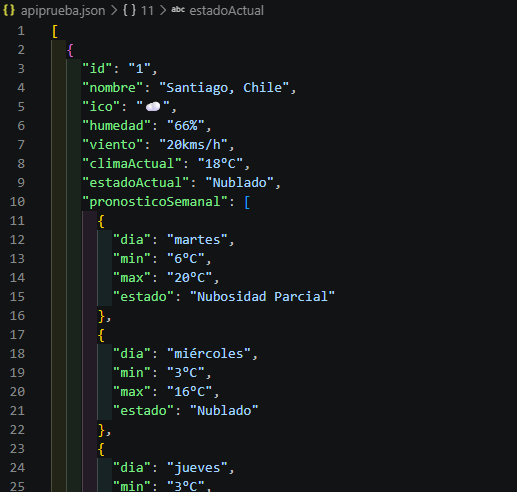
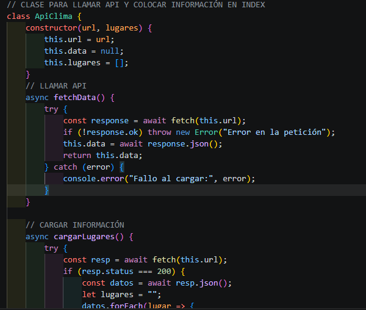
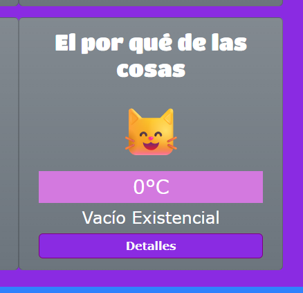
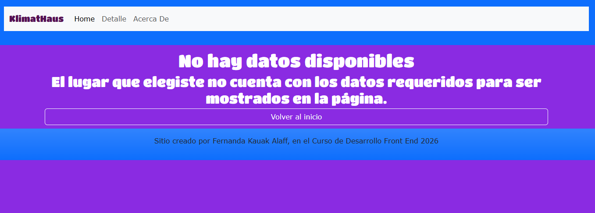
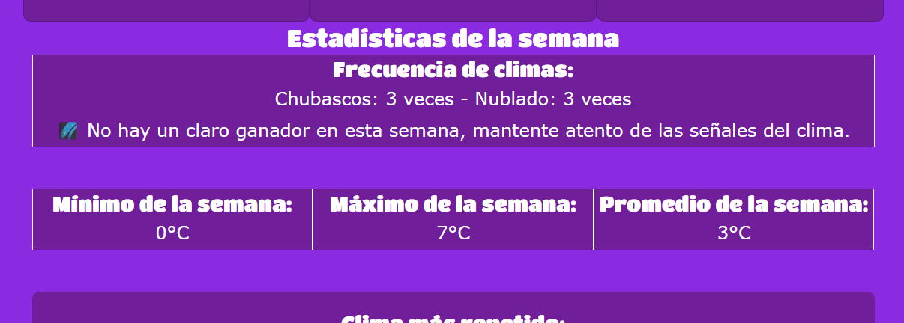
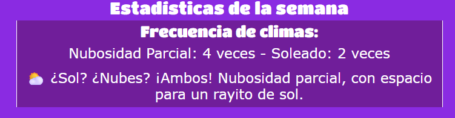
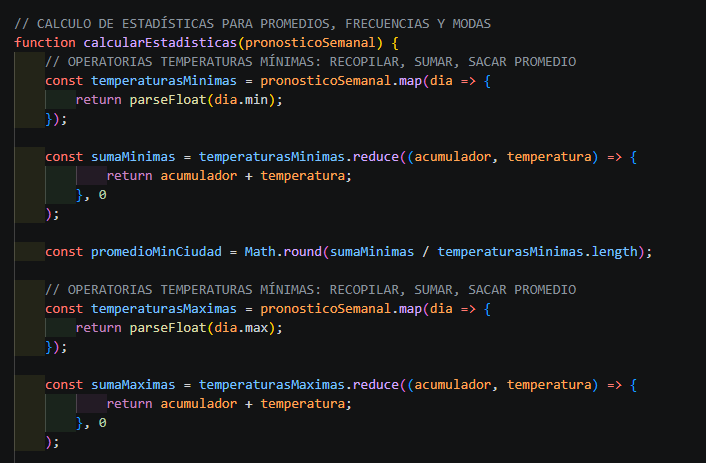

  # ¡Bienvenidos al sitio web de KlimatHaus!
  
  ## Índice
  - Con respecto al repositorio
  - Links de descarga y vista
  - Actualización 8-08-2026
  - Actualización 04-07-2026
  - Actualización 21-06-2026
  
  ## Con respecto al repositorio
  Este sitio fue hecho por **Fernanda Kauak Alaff** para el **Curso de Desarrollo Front End 2026**, iniciado en el módulo 2 (por eso tiene M2 en el nombre, pero tendrá actualizaciones cada módulo) y consiste en un sitio para predecir el clima.
  
  La idea que le dí a **KlimatHaus** (cuyo nombre viene de *"Klimatisch"* y *"Haus"*, *'Climático'* y *'Casa'* en alemán) es mostrar ciudades en las que he vivido (Osorno y Santiago), ciudades donde viven seres queridos que no sean las dos mencionadas (Panguipulli, Toronto, Londres y Melbourne) y ciudades relacionadas a un proyecto personal (Kioto, Málaga y Nueva York). Incluso mi sitio es tan avanzado que capta lugares en el espacio.
  
  Espero que les guste y cualquier duda que tengan, así como el resultado final de la revisión, me la pueden hacer llegar directamente.

  ## Descarga
  - Este se va a subir como ZIP al Aula Digital, pero también pueden acceder en el siguiente link:
  <https://github.com/fernandakauak/weather-frontend-m2.git>
  - También pueden verlo en acción aquí:
  <https://fernandakauak.github.io/weather-frontend-m2/>

  ### ¡Que tengan una buena semana!

  ---
  ---

  ## Actualización 04-07-2026: Versión Portafolio - Módulo 5
  **Antes de empezar:** *De ahora en adelante las actualizaciones del README tendrán imágenes. Si no se ven, pueden verlas en la carpeta img-readme. En el zip que se subirá a la plataforma, estarán en un archivo Word*
  En esta actualización se añadió lo siguiente:
  1. Los datos cargados de clima pasaron de ser un array en el archivo app.js a un archivo JSON llamado ***apiprueba.json**, el cuál actua como API de prueba.
  

  2. Se creó la clase **ApiClima** para llamar la API con la función asíncrona **FetchData** y cargar en el archivo index.html con la función **cargarLugares**, también asíncrona. Sin embargo, no se pudo replicar lo mismo en la carga de detalle (hubo conflictos de código y prioricé el que se pasara todo a la sección "Detalle").
! [Parte de la clase ApiClima - 1](img-readme/class-2.png)

  3. En la función cargarDetalle se añadió una condición para un error consistente en la falta de datos de pronósticoSemanal (parte de la API de prueba). Para mostrar su funcionamiento, **se agregó un sitio nuevo llamado "El Por Qué de las Cosas"** que no lo contiene a propósito y despliega un mensaje de error en console.log y en la pantalla. Lo mismo ocurre cuando se va a la sección **"Detalle"**.
 ! [Cuando ves sus detalles, llegas a la sección y abres la consola](img-readme/aviso-no-dato_consola.png)

  4. En la sección de detalle de cada ciudad, se despliega una sección llamada **"Frecuencia de Climas"**. Aquí se muestra los climas que se repiten y cuánto se repiten y un mensaje personalizado en caso de que uno se repita 4 veces o más. También hay un mensaje cuando hay empates o ninguno de estos climas llegue a las 4 repeticiones.
  
  

  5. Ahora todos los cálculos relacionados a promedios, frecuencias y modas se encuentran dentro de una función llamada **calcularEstadisticas**. Después de hacerse los cálculos, se liberan los valores usando un return para que no queden como funciones locales.
  
  
   ### ¡Saludos y muchas gracias! La próxima actualización será más eficiente :smiley_cat:

  ---

  ## Actualización 04-07-2026: Versión Portafolio - Módulo 4
  Se añadieron las siguientes funciones:
  1. Primero se modificó el arreglo **lugares** (ubicado en app.js) para desplegar nuevos datos: **pronosticoSemanal** contiene un arreglo propio con el día de la semana, la temperatura mínima, la temperatura máxima y el estado (nublado, soleado, etc). Estos datos nuevos van a calcularse usando las funciones mencionadas en los siguientes puntos.
  2. **Promedio de temperaturas mínimas** de cada ciudad *(uso de parseInt para rescatar el número del string, for para la operación y Math.round para redondear el decimal)*
  3. **Promedio de temperaturas máximas** de cada ciudad *(se usó lo mismo para el caso anterior)*
  4. **Promedio de los resultados** de promedios anteriores *(suma simple de los dos resultados anteriores y un Math.round para redondear decimales)*
  5. Uso de función para *sacar la moda* de los estados de clima de cada ciudad según la semana y **definir cuál es el que se repite**. Esta recorre un arreglo creado con los estados de la semana y se puede aplicar en todas las ciudades por medio de los forEach ya creados.
  6. Por medio de una condicional *(if/if else/else)* para entregar un mensaje **según el clima que más se repita**. Hay 4 casos de clima: Soleado, nubosidad parcial, nublado y chubascos.
    - El else se usa para los climas de Alfa Centauro, en la aplicación sale como 0°C, pero se usa otros "climas" (básicamente para graficar que no se sabe qué hay... aún).
  7. Adaptación de la UI de la sección de **detalles.html** para añadir los elementos nuevos. Se ubican debajo de todos los climas desplegados con los datos nuevos del array mencionado al inicio.

  ### Como ven, las actualizaciones recientes irán primero ¡Nos vemos en el siguiente módulo! :smiley_cat:

  ---

  ## Actualización 21-06-2026: Versión Portafolio - Módulo 3
  - Se reordenó el CSS con la metodología **BEM** para mayor claridad de uso para ocasiones futuras.
  - Se añadió el preprocesador Sass para optimizar el uso de recursos. **Cuenta con variables de tamaños, colores y fuentes tipográficas, mixins para cards, títulos e íconos**.
  - Se llama a Bootstrap 5 **vía CDN** y utilizó el **sistema de grillas** para ordenar los elementos y mantener el sitio responsivo, la **barra de navegación (navbar)** que se adapta según tamaño de pantalla, la estructura de las **cards** (utilizadas en las predicciones de clima con mejoras aparte) y el **footer**.

  ### ¡Nos vemos a la próxima! :smiley_cat: